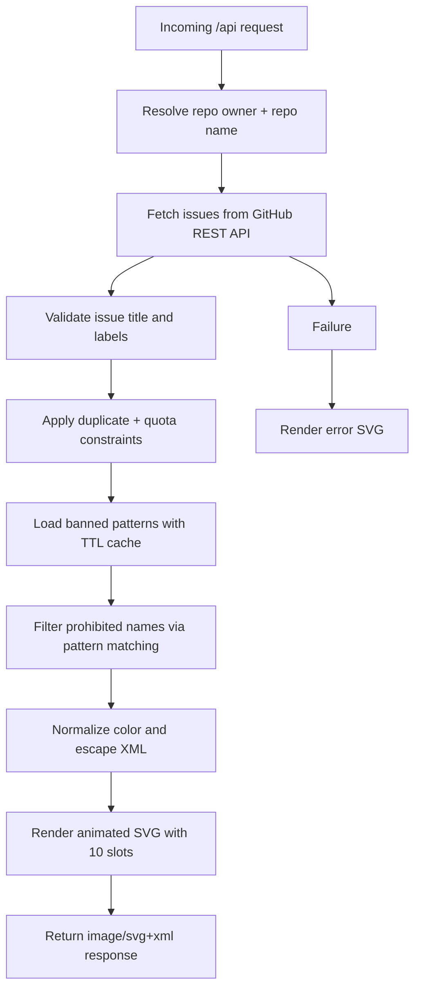

<div align="center">

<pre>
 ______     __     ______   __  __     __  __     ______        __     ______     ______     __  __     ______     ______    
/\  ___\   /\ \   /\__  _\ /\ \_\ \   /\ \/\ \   /\  == \      /\ \   /\  ___\   /\  ___\   /\ \/\ \   /\  ___\   /\  ___\   
\ \ \__ \  \ \ \  \/_/\ \/ \ \  __ \  \ \ \_\ \  \ \  __<      \ \ \  \ \___  \  \ \___  \  \ \ \_\ \  \ \  __\   \ \___  \  
 \ \_____\  \ \_\    \ \_\  \ \_\ \_\  \ \_____\  \ \_____\     \ \_\  \/\_____\  \/\_____\  \ \_____\  \ \_____\  \/\_____\ 
  \/_____/   \/_/     \/_/   \/_/\/_/   \/_____/   \/_____/      \/_/   \/_____/   \/_____/   \/_____/   \/_____/   \/_____/ 
                                                                                                                             
 __  __     ______     ______     ______     ______     ______        ______     ______     _____     ______     ______      
/\ \_\ \   /\  ___\   /\  == \   /\  __ \   /\  ___\   /\  ___\      /\  == \   /\  __ \   /\  __-.  /\  ___\   /\  ___\     
\ \  __ \  \ \  __\   \ \  __<   \ \ \/\ \  \ \  __\   \ \___  \     \ \  __<   \ \  __ \  \ \ \/\ \ \ \ \__ \  \ \  __\     
 \ \_\ \_\  \ \_____\  \ \_\ \_\  \ \_____\  \ \_____\  \/\_____\     \ \_____\  \ \_\ \_\  \ \____-  \ \_____\  \ \_____\   
  \/_/\/_/   \/_____/   \/_/ /_/   \/_____/   \/_____/   \/_____/      \/_____/   \/_/\/_/   \/____/   \/_____/   \/_____/   
                                                                                                                             
</pre>

A serverless logging-style visualization library that converts validated GitHub issue activity into a live animated SVG badge for README dashboards and community telemetry.

[](LICENSE)
[](https://nodejs.org/)
[](https://vercel.com/)
[](https://docs.github.com/en/rest/issues/issues)

## Example in Markdown:


</div>

## Table of Contents

- [Features](#features)
- [Tech Stack & Architecture](#tech-stack--architecture)
- [Getting Started](#getting-started)
- [Testing](#testing)
- [Deployment](#deployment)
- [Usage](#usage)
- [Configuration](#configuration)
- [License](#license)
- [Support the Project](#support-the-project)

## Features

- Serverless SVG generation endpoint that renders an animated “heroes board” from GitHub issues.
- Strict issue-title parsing via a structured contract: `<HeroeName | display_name | #hexcolor>`.
- Label-based admission control (`Valid` label required).
- Duplicate and abuse prevention:
  - Max 2 accepted issues per GitHub account.
  - Case-insensitive de-duplication of displayed names.
  - Title-length ceiling for predictable payload quality.
- Runtime profanity and abuse filtering via remote banned-pattern dictionaries.
- Pattern engine with wildcard and composition support (`*`, `+`, `&&`) for flexible moderation rules.
- In-memory TTL caching for banned word lists to reduce outbound API load and latency.
- Defensive SVG safety controls:
  - XML escaping for dynamic text.
  - Hex color validation and fallback palette strategy.
- Operationally friendly defaults:
  - Token auto-detection from `GH_TOKEN` / `GITHUB_TOKEN`.
  - No-token mode for public repositories (rate-limit tradeoff).
- Error-mode SVG output instead of plain JSON errors, preserving badge embedding behavior.

> [!IMPORTANT]
> This project fetches data from GitHub APIs at request time. For production-grade reliability and higher request quotas, configure a GitHub token.

## Tech Stack & Architecture

### Core Stack

- **Runtime:** Node.js (serverless target)
- **Platform:** Vercel Serverless Functions
- **Language:** JavaScript (ES Modules)
- **Data Source:** GitHub REST API (issues + git trees/raw content)
- **Output Format:** SVG + inline CSS animations

### Project Structure

```text
.
├── api/
│   └── index.js                 # Main serverless handler and rendering pipeline
├── banned-words/                # Local word lists (reference/data assets)
├── LICENSE
├── package.json
└── README.md
```

### Key Design Decisions

- **Single-entry serverless handler** keeps deployment simple and platform-portable.
- **Validation-first ingestion pipeline** ensures only syntactically valid and moderated entries become visible.
- **Fail-soft moderation data loading** uses caching and graceful degradation when external resources fail.
- **Presentation stability by padding to 10 rows** keeps badge dimensions and layout deterministic.
- **SVG as transport format** makes the badge embeddable in Markdown, docs, and profile READMEs.



> [!TIP]
> Treat this endpoint as a read-optimized telemetry surface, not as a persistence layer. All state is computed per request.

## Getting Started

### Prerequisites

- Node.js `>=18`
- npm `>=9`
- A GitHub repository with issues enabled
- (Recommended) GitHub token for higher API rate limits
- (Optional) Vercel account for hosted deployment

### Installation

```bash
git clone https://github.com/<your-org>/Issues-heroes-badge.git
cd Issues-heroes-badge
npm install
```

> [!NOTE]
> If you only use this locally for development and testing with public repositories, a token is optional, but rate limits may be reached quickly.

## Testing

This repository currently ships without a configured automated test suite. Use the commands below as operational checks and baseline quality gates.

```bash
# Dependency integrity check
npm install

# Package script status (currently placeholder in package.json)
npm test

# Optional local smoke test if you run a local serverless emulator
# (example for Vercel CLI users)
# npx vercel dev
# curl "http://localhost:3000/api?user=readme-SVG&repo=Issues-heroes-badge"
```

> [!WARNING]
> `npm test` is currently a placeholder command and exits with a non-zero status by default. Replace it with real unit/integration/lint scripts for CI readiness.

## Deployment

### Vercel Deployment (Recommended)

1. Push this repository to GitHub.
2. Import it into Vercel as a new project.
3. Configure environment variables (`GITHUB_TOKEN` recommended).
4. Deploy to Production.

### Suggested CI/CD Integration

- Trigger deploys on `main` branch pushes.
- Add a pre-deploy stage with:
  - `npm ci`
  - static checks (after you add linter/test scripts)
- Include synthetic health check hitting `/api` post-deployment.

### Containerization Note

This project is optimized for serverless delivery. If containerized, wrap the handler with a compatible Node HTTP adapter and ensure outbound access to GitHub APIs.

## Usage

### Markdown Badge Embed

```md

```

### Example Issue Contract

Create issues whose title follows this exact format:

```text
<HeroeName|CyberKnight|#3f88e6>
```
```text
<HeroeName|CyberKnight>
```

And ensure the issue contains the `Valid` label.

### Endpoint Behavior Overview

```js
// Request example
// GET /api?user=octocat&repo=Hello-World

// High-level behavior:
// 1) Pull issues from GitHub
// 2) Validate title format and "Valid" label
// 3) Reject banned or duplicate names
// 4) Render animated SVG response
```

> [!CAUTION]
> User-provided names are rendered into SVG text nodes. The library escapes XML-sensitive characters, but you should still enforce moderation policies in your issue workflow.

## Configuration

### Environment Variables

| Variable | Required | Default | Description |
| --- | --- | --- | --- |
| `GITHUB_TOKEN` | No* | unset | GitHub token used for authenticated API calls. |
| `GH_TOKEN` | No* | unset | Alternative token variable; checked alongside `GITHUB_TOKEN`. |
| `BANNED_WORDS_REPO` | No | `readme-SVG/Banned-words` | Source repository for banned-word dictionaries. |
| `BANNED_WORDS_BRANCH` | No | `main` | Branch used when reading moderation dictionaries. |

\* Required for production-grade quota and private repository access.

### Runtime Query Parameters

| Parameter | Required | Default | Description |
| --- | --- | --- | --- |
| `user` | No | `readme-SVG` | GitHub owner/user/organization name. |
| `repo` | No | `Issues-heroes-badge` | Target repository to inspect issues from. |

### Configuration Strategy

1. Start with defaults for public repositories.
2. Add `GITHUB_TOKEN` in deployment secrets.
3. Override moderation source via `BANNED_WORDS_REPO` if you maintain custom dictionaries.
4. Keep issue template and labels standardized to protect pipeline quality.

## License

This project is released under the **MIT License**. See [`LICENSE`](LICENSE) for full terms.

## Support the Project

[](https://www.patreon.com/OstinFCT)
[](https://ko-fi.com/fctostin)
[](https://boosty.to/ostinfct)
[](https://www.youtube.com/@FCT-Ostin)
[](https://t.me/FCTostin)

If you find this tool useful, consider leaving a star on GitHub or supporting the author directly.
